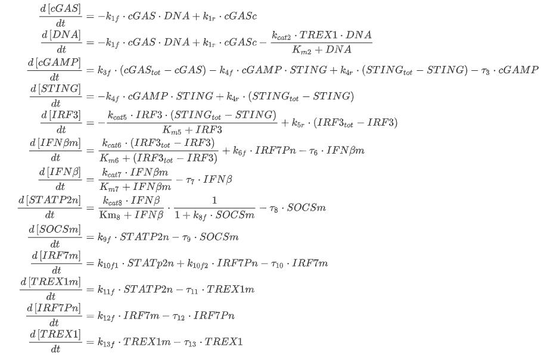
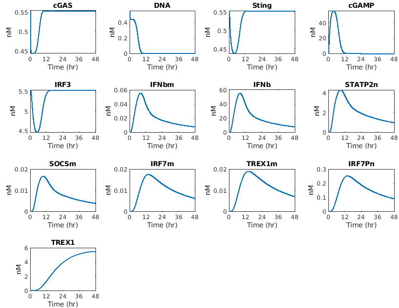

# ODEModel-cGASPathway-

This repository contains a computational model simulating the dynamics of the cGAS and subsequent JAK/STAT pathways. For more detail on the model, please refer to our associated [publication]( https://doi.org/10.1016/j.jtbi.2018.11.001).

In brief, this model simulates a response to a DNA transfection, which leads to the production of interferon, and activation of various feedback responses (e.g. IRF7). The model consists of 13 differential equations tracking intramolecular concentrations over time. 

This model was trained on data from literature using MCMC to determine posterior probably distributions for all unknown parameters. The simulation file contains a parameter set that minimized model error. Use this file to simulate the model and generate plots of the dynamics.

